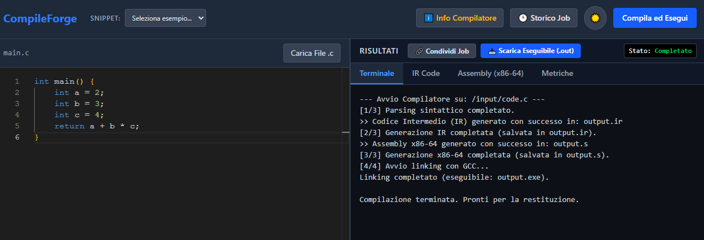

# CompileForge

> A locally-hosted, microservices-based Compiler-as-a-Service exposing a custom C compiler through a web UI — submit C source code, watch it compile in a sandboxed container, and download the resulting executable.

## 📸 Quick Showcase

<p align="center">
  
</p>

<p align="center">
  <em>Write C code in the browser, compile it, and inspect the IR, assembly, and execution output — all in one view.</em>
</p>

<p align="center">
  
</p>

<p align="center">
  <em>Real-time job status via Server-Sent Events — no manual refresh needed.</em>
</p>


## Overview & Architecture

### What is CompileForge
CompileForge is a self-hosted **Compiler-as-a-Service** platform. It wraps a custom, from-scratch C compiler (see [`compiler-image/`](./compiler-image)) behind a web UI and a microservices backend, so you can submit C source code from the browser and get back the intermediate representation, the generated x86-64 assembly, and a runnable executable — without installing a toolchain locally.

It is designed to run **entirely on your own machine**. There is no remote deployment, no public endpoint, and no multi-tenant hosting — every service in this repository is meant to be built and run locally via Docker Compose. See [Security Model](#security-model) for why this matters and how it's enforced.

### Microservices Architecture
Instead of compiling code synchronously inside a single web server, CompileForge splits the work across dedicated services so that a slow or malicious compile job can never block the API or take down the whole system.

| Service | Role |
|---|---|
| **UI** (React + Monaco) | Code editor, job history, live status via Server-Sent Events. |
| **Gateway** (Fastify) | The only service exposed to the browser. Validates and authenticates requests, writes jobs to Postgres, publishes them to RabbitMQ, and streams status updates back to the client. |
| **RabbitMQ** | Durable job queue between the Gateway and the Worker, with a Dead Letter Queue for jobs that fail after repeated retries. Decouples "accepting a job" from "running a job". |
| **Worker** | Pulls one job at a time from the queue, writes the source to disk, and launches the actual compiler **inside a locked-down, disposable Docker container** (no network, dropped capabilities, memory/PID limits, non-root user). This is where untrusted user code actually runs. |
| **Postgres** (via Drizzle ORM) | Source of truth for every job: status, source code, IR, assembly, output, timestamps. |
| **Redis** | Pub/Sub backbone for real-time status updates — the Gateway subscribes on behalf of connected clients and relays worker progress over SSE. |
| **Prometheus + Grafana** | Metrics and dashboards for job throughput, queue depth, compile duration, and success/failure rate. |

### Job Lifecycle

```text
┌────────┐    POST /compile   ┌─────────┐    publish   ┌───────────┐
│   UI   │ ──────────────────▶│ Gateway │ ────────────▶│ RabbitMQ  │
│(Editor)│                    │(Fastify)│              │  (queue)  │
└────────┘                    └────┬────┘              └─────┬─────┘
    ▲                              │                         │
    │                        write job (pending)             │ consume
    │                              ▼                         ▼
    │                        ┌──────────┐              ┌────────────┐
    │      SSE / polling     │ Postgres │ update status│   Worker   │
    └────────────────────────│  (jobs)  │◀─────────────│ (1 job at  │
    live status updates      └──────────┘  + results   │  a time)   │
    ▲                                                  └───┬───┬────┘
    │                                                      │   │
    │ publish status                       publish status  │   │ docker run
    │ via Redis                            via Redis       │   │ (sandboxed)
    ▼                                                      ▼   ▼
┌──────────┐                                               │ ┌──────────────────┐
│  Redis   │◀──────────────────────────────────────────────┘ │  compiler-image  │
│ Pub/Sub  │                                                 │ (sandboxed C     │
└──────────┘                                                 │  compiler run)   │
                                                             └──────────────────┘
```

1. **Submit** — the browser sends the C source to the Gateway (`POST /compile`). The Gateway validates it, writes a `pending` job to Postgres, and publishes a message to the `compile_jobs` queue in RabbitMQ. The client immediately gets a `job_id` back and opens an SSE connection to `/status/:job_id/stream`.
2. **Queue** — RabbitMQ holds the job durably until a Worker is free to pick it up. If no Worker is available, jobs simply wait — the Gateway stays responsive regardless of load.
3. **Sandbox** — the Worker consumes one job, writes the source to a shared temp directory, and launches a brand-new, disposable container from `compiler-image` to actually run the compiler — with no network access, no Linux capabilities, a hard memory/CPU/PID ceiling, and a strict execution timeout. If the container is killed by the timeout, the Worker force-removes it so nothing is ever left running in the background.
4. **Result** — the Worker writes the IR, assembly, output, and final status back to Postgres and publishes the update on Redis. The Gateway relays that update to the browser over the open SSE connection (falling back to polling if the stream drops), and the UI unlocks the download link for the compiled executable.

If a job fails three times, it's routed to a Dead Letter Queue instead of retrying forever — so a systematically broken job can't loop indefinitely and starve the queue for everyone else.

## ⚙️ The Compiler Engine

The beating heart of CompileForge is not a standard GCC or Clang wrapper, but a **custom C compiler written entirely from scratch**. It translates raw C source code all the way down to x86-64 assembly instructions.

To keep this document focused, the deep technical breakdown of the compiler's internal pipeline has been kept separate in its own dedicated repository. 
👉 **[Read the full Compiler Engine README here](https://github.com/michelecortiana/my-compiler)**.

### Core Features
* **Custom Lexer & Parser:** A handcrafted recursive descent parser that builds a full Abstract Syntax Tree (AST).
* **AST Optimizations:** Implements compile-time optimizations like Constant Folding and basic Dead Code Elimination.
* **Intermediate Representation (IR):** Lowers the AST into a custom Three-Address Code (TAC) format for easier analysis.
* **x86-64 Backend:** Generates raw Assembly natively targeting the Linux System V ABI.
* **Language Support:** Handles pointers (with multi-level dereferencing), arrays, `struct`s (with precise memory padding/alignment), and standard control flow (`if`, `while`, `for`, `break`, `continue`).
* **Memory Management:** Supports dynamic heap allocation (`malloc`, `free`) and accurate compile-time `sizeof` evaluation.

### ⚠️ Known Limitations
Because this compiler is an educational engineering project, it intentionally omits several features mandated by the full ISO C standard to maintain a manageable, streamlined codebase. 

Notably, there is **no preprocessor** (no `#include` or `#define`), no support for multidimensional arrays, no unsigned types, and functions cannot return `void`. 

For the complete and detailed list of language constraints, please refer to the **[Known Limitations](https://github.com/michelecortiana/my-compiler#known-limitations)** section of the compiler's repository (this information is also available directly within the web UI's info panel).

## 🔒 Security Model

Compiling and executing arbitrary, untrusted C code is inherently dangerous. To mitigate the massive security risks associated with Remote Code Execution (RCE), CompileForge employs a strict **Defense-in-Depth** strategy. 

### 1. Local-Only by Design
CompileForge is explicitly designed to be a local-only tool. It is **not** meant to be deployed on a public-facing server.
* All exposed ports in the `docker-compose.yml` (Gateway, RabbitMQ, Postgres, Grafana) are strictly bound to the loopback interface (`127.0.0.1`). 
* The infrastructure is accessible only from your local machine, completely preventing LAN or WAN access.

### 2. Sandboxed Execution (Docker-outside-of-Docker)
The Worker service does not run the compiler directly. Instead, it uses the Docker-outside-of-Docker (DooD) pattern by mounting the host's Docker socket. For every single compile job, it spawns a short-lived, deeply restricted container. 

Each `compiler-image` container is severely neutered using the following runtime constraints:
* **No Network:** `--network none` ensures absolute isolation from the internet and internal Docker networks.
* **Dropped Capabilities:** `--cap-drop ALL` and `--security-opt no-new-privileges` prevent any form of privilege escalation inside the container.
* **Resource Quotas:** Constrained via `--memory=256m`, `--cpus=0.5`, and `--pids-limit=64` to prevent fork bombs, infinite loops, and memory exhaustion.
* **Non-Root Execution:** The process runs as a restricted, unprivileged user.
* **Strict Timeouts:** Containers are forcefully killed and pruned (`--rm`) if they exceed the maximum allowed execution time, leaving no orphaned processes behind.

### 3. API Key Authentication
Even within the local environment, all interactions with the Gateway (such as submitting a job via `POST /compile` or polling via `GET /status/:id`) are protected by a mandatory API Key (`x-api-key` header). Unauthorized requests are immediately rejected by the Fastify server.

### 4. Secrets Management
Sensitive credentials (database passwords, message broker logins, API keys, and Prometheus metrics tokens) are securely managed and actively excluded from version control via `.gitignore`.
* The repository provides `.example` templates.
* Users must manually generate their own secure credentials and inject them via `.env` (for host-level scripts), `.env.docker` (for the Compose stack), and `ui/.env.local` (for the React UI).
* Prometheus authentication relies on a securely mounted file (`secrets/metrics_token.txt`) mapped directly into the container as a read-only volume.

## 📊 Monitoring & Observability

To ensure the infrastructure remains healthy and to track the performance of the compiler pipeline, CompileForge includes a fully pre-configured observability stack.

* **Prometheus:** Acts as the time-series database. It actively scrapes custom metrics exposed by the Fastify Gateway, the Node.js Worker, and the RabbitMQ broker. The scraping endpoints are secured and authenticated via a shared `METRICS_TOKEN`.
* **Grafana:** Provides the visual interface. It is configured with "zero-config provisioning," meaning the Prometheus datasource and the official CompileForge dashboards are automatically loaded on startup without requiring manual GUI setup.

### Included Dashboards
The pre-provisioned dashboard gives you real-time insights into the system's core vital signs:
* **Total Jobs Submitted:** The absolute volume of compile requests handled by the Gateway.
* **Jobs in Queue:** The current depth of the `compile_jobs` RabbitMQ queue, helping you identify bottlenecks if the Worker is struggling to keep up.
* **Average Compile Duration:** The mean time taken by the sandboxed compiler container to process the C source code and generate the assembly/executable.
* **Success/Failure Rates:** A breakdown of job outcomes to quickly spot systemic failures or broken payloads.

## 🛠️ Technologies Used

CompileForge is built on a modern, robust stack designed for high-performance asynchronous processing and strict execution isolation.

| Category | Technology |
| :--- | :--- |
| **Frontend UI** | React, TypeScript, Monaco Editor, Tailwind CSS |
| **API Gateway** | Node.js, Fastify, TypeScript |
| **Database & ORM** | PostgreSQL, Drizzle ORM |
| **Message Broker** | RabbitMQ |
| **Pub/Sub & Cache** | Redis |
| **Sandboxing & Infra**| Docker, Docker-outside-of-Docker (DooD) |
| **Compiler Engine** | C (Custom implementation), GCC (for linking) |

## 📦 Installation Guide

### Prerequisites
* **Docker & Docker Compose:** Required to run the core microservices infrastructure and the sandbox.
* **Node.js (v18+):** *Optional*, required only to run the React frontend locally in development mode.

### 1. Clone the Repository
```bash
git clone [https://github.com/yourusername/compileforge.git](https://github.com/yourusername/compileforge.git)
cd compileforge
```

### 2. Configure Secrets
Security credentials are purposefully excluded from version control. You must create the environment files from the provided templates and fill in your own secure values (e.g., strong passwords and random 64-character hex strings for tokens).

```bash
cp .env.example .env.docker
cp .env.example .env
cp ui/.env.local.example ui/.env.local
cp secrets/metrics_token.txt.example secrets/metrics_token.txt
```
*⚠️ **Important:** Ensure that the `API_KEY` and `METRICS_TOKEN` values match exactly across all your `.env` files and the `secrets/metrics_token.txt` file.*

### 3. Build the Compiler Image
Before starting the backend, you must build the isolated Docker image that the Worker will use to sandbox the C compiler:
```bash
docker build -t compiler-image ./compiler-image
```

### 4. Launch the Infrastructure
Spin up the entire microservices stack (Postgres, Redis, RabbitMQ, Gateway, Worker, Prometheus, and Grafana) in the background:
```bash
docker compose up -d --build
```
*Note: On your very first run, you must synchronize the database schema using Drizzle ORM:*
```bash
docker exec gateway npx drizzle-kit push --force
```

### 5. Run the UI (Development Mode)
Open a new terminal window, navigate to the frontend directory, install the dependencies, and start the React development server:
```bash
cd ui
npm install
npm run dev
```

### 6. Submit Your First Compile Job
Open your browser and navigate to `http://localhost:5173`. Write your C code in the editor, hit the compile button, and watch the microservices seamlessly queue, sandbox, compile, and return your x86-64 assembly and executable!

## 🔄 Continuous Integration (CI/CD)

CompileForge uses a robust GitHub Actions pipeline to ensure code quality and system integrity on every push or pull request to the `main` branch. 

The automated workflow validates both the codebase and the infrastructure by performing the following checks:
* **Frontend Integrity:** Runs a strict production build of the React UI to catch TypeScript and ESLint errors before they reach production.
* **Infrastructure Spin-up:** Automatically builds the isolated `compiler-image` and orchestrates the full microservices stack (Gateway, Worker, RabbitMQ, Redis, Postgres) using Docker Compose directly inside the CI runner.
* **End-to-End (E2E) Testing:** Submits a mock C program to the Gateway API via HTTP, extracts the generated Job ID, and polls the status endpoint to verify that the entire asynchronous lifecycle (Queueing ➔ Sandboxing ➔ Compiling ➔ Database Updates) completes successfully without deadlocks or crashes.

## 📁 Project Structure

The repository is organized into distinct, self-contained microservices and configuration directories:

```text
compileforge/
├── .github/                 # CI/CD workflows for GitHub Actions
├── compiler-image/          # The custom C compiler source code, headers, and Dockerfile
├── gateway/                 # Fastify API server handling HTTP requests and SSE streaming
├── grafana-provisioning/    # Pre-configured Grafana dashboards and Prometheus datasources
├── secrets/                 # Git-ignored folder for Docker secrets (e.g., metrics tokens)
├── ui/                      # React + Vite frontend application (TypeScript, Tailwind, Monaco)
├── worker/                  # Node.js worker consuming RabbitMQ and spawning DooD containers
├── worker-tmp/              # Host-mounted volume for temporary file sharing during compilation
├── docker-compose.yml       # Core infrastructure orchestration
├── prometheus.yml           # Prometheus metrics scraping configuration
├── rabbitmq_enabled_plugins # RabbitMQ plugin configuration (e.g., for Prometheus integration)
├── stress_test.sh           # Bash script for local load testing and E2E validation
└── README.md                # You are here
```

## 📄 License

This project is open-source and available under the **MIT License**.
See the [LICENSE](LICENSE) file for more details.
