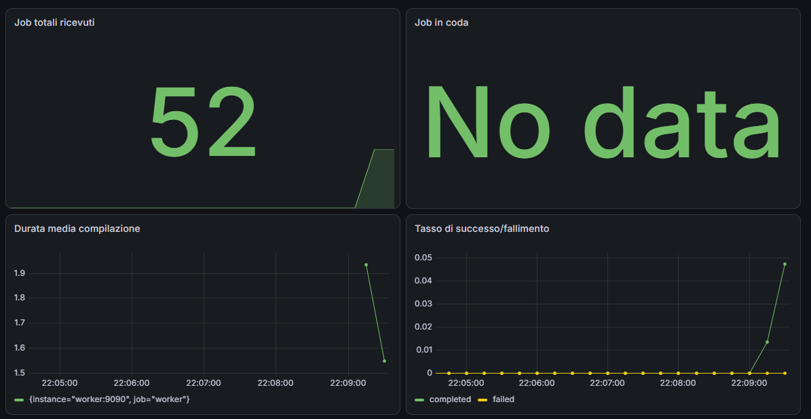

# CompileForge

> A locally-hosted, microservices-based Compiler-as-a-Service exposing a custom C compiler through a web UI — submit C source code, watch it compile in a sandboxed container, and download the resulting executable.

## Table of Contents

- [Quick Showcase](#quick-showcase)
- [Overview & Architecture](#overview--architecture)
  - [What is CompileForge](#what-is-compileforge)
  - [Microservices Architecture](#microservices-architecture)
  - [Job Lifecycle](#job-lifecycle)
- [The Compiler Engine](#the-compiler-engine)
  - [Core Features](#core-features)
  - [Known Limitations](#known-limitations)
- [Service Limitations](#service-limitations)
- [Security Model](#security-model)
  - [1. Local-Only by Design](#1-local-only-by-design)
  - [2. Sandboxed Execution (Docker-outside-of-Docker)](#2-sandboxed-execution-docker-outside-of-docker)
  - [3. API Key Authentication](#3-api-key-authentication)
  - [4. Secrets Management](#4-secrets-management)
  - [5. Least-Privilege Containers](#5-least-privilege-containers)
- [Monitoring & Observability](#monitoring--observability)
  - [Included Dashboards](#included-dashboards)
  - [Accessing Grafana](#accessing-grafana)
- [Technologies Used](#technologies-used)
- [Installation Guide](#installation-guide)
  - [Prerequisites](#prerequisites)
  - [1. Clone the Repository](#1-clone-the-repository)
  - [2. Run the Automated Setup](#2-run-the-automated-setup)
  - [3. Submit Your First Compile Job](#3-submit-your-first-compile-job)
  - [UI Development Mode (Optional)](#ui-development-mode-optional)
- [Environment Variables Reference](#environment-variables-reference)
- [Load Testing](#load-testing)
- [API Reference](#api-reference)
- [Continuous Integration (CI/CD)](#continuous-integration-cicd)
- [Troubleshooting](#troubleshooting)
- [Project Structure](#project-structure)
- [License](#license)

<a name="quick-showcase"></a>
## Quick Showcase

<p align="center">
  
</p>

<p align="center">
  <em>Write C code in the browser, compile it, and inspect the IR, assembly, and execution output — all in one view.</em>
</p>

<p align="center">
  
</p>

<p align="center">
  <em>Real-time job status via Server-Sent Events — no manual refresh needed.</em>
</p>


<a name="overview--architecture"></a>
## Overview & Architecture

<a name="what-is-compileforge"></a>
### What is CompileForge
CompileForge is a self-hosted **Compiler-as-a-Service** platform. It wraps a custom, from-scratch C compiler (see [`compiler-image/`](./compiler-image)) behind a web UI and a microservices backend, so you can submit C source code from the browser and get back the intermediate representation, the generated x86-64 assembly, and a runnable executable — without installing a toolchain locally.

It is designed to run **entirely on your own machine**. There is no remote deployment, no public endpoint, and no multi-tenant hosting — every service in this repository is meant to be built and run locally via Docker Compose. See [Security Model](#security-model) for why this matters and how it's enforced.

<a name="microservices-architecture"></a>
### Microservices Architecture
Instead of compiling code synchronously inside a single web server, CompileForge splits the work across dedicated services so that a slow or malicious compile job can never block the API or take down the whole system.

| Service | Role |
|---|---|
| **UI** (React + Monaco) | Code editor, job history, live status via Server-Sent Events. |
| **Gateway** (Fastify) | The only service exposed to the browser. Validates and authenticates requests, writes jobs to Postgres, publishes them to RabbitMQ, and streams status updates back to the client. |
| **RabbitMQ** | Durable job queue between the Gateway and the Worker, with a Dead Letter Queue for jobs that fail after repeated retries. Decouples "accepting a job" from "running a job". |
| **Worker** | Pulls one job at a time from the queue, writes the source to disk, and launches the actual compiler **inside a locked-down, disposable Docker container** (no network, dropped capabilities, memory/PID limits, non-root user). This is where untrusted user code actually runs. |
| **Postgres** (via Drizzle ORM) | Source of truth for every job: status, source code, IR, assembly, output, timestamps. |
| **Redis** | Pub/Sub backbone for real-time status updates — the Gateway subscribes on behalf of connected clients and relays worker progress over SSE. |
| **Prometheus + Grafana** | Metrics and dashboards for job throughput, queue depth, compile duration, and success/failure rate. |

<a name="job-lifecycle"></a>
### Job Lifecycle

```text
┌────────┐    POST /compile   ┌─────────┐    publish   ┌───────────┐
│   UI   │ ──────────────────▶│ Gateway │ ────────────▶│ RabbitMQ  │
│(Editor)│                    │(Fastify)│              │  (queue)  │
└────────┘                    └────┬────┘              └─────┬─────┘
    ▲                              │                         │
    │                        write job (pending)             │ consume
    │                              ▼                         ▼
    │                        ┌──────────┐              ┌────────────┐
    │      SSE / polling     │ Postgres │ update status│   Worker   │
    └────────────────────────│  (jobs)  │◀─────────────│ (1 job at  │
    live status updates      └──────────┘  + results   │  a time)   │
    ▲                                                  └───┬───┬────┘
    │                                                      │   │
    │ publish status                       publish status  │   │ docker run
    │ via Redis                            via Redis       │   │ (sandboxed)
    ▼                                                      ▼   ▼
┌──────────┐                                               │ ┌──────────────────┐
│  Redis   │◀──────────────────────────────────────────────┘ │  compiler-image  │
│ Pub/Sub  │                                                 │ (sandboxed C     │
└──────────┘                                                 │  compiler run)   │
                                                             └──────────────────┘
```

1. **Submit** — the browser sends the C source to the Gateway (`POST /compile`). The Gateway validates it, writes a `pending` job to Postgres, and publishes a message to the `compile_jobs` queue in RabbitMQ. The client immediately gets a `job_id` back and opens an SSE connection to `/status/:job_id/stream`.
2. **Queue** — RabbitMQ holds the job durably until a Worker is free to pick it up. If no Worker is available, jobs simply wait — the Gateway stays responsive regardless of load.
3. **Sandbox** — the Worker consumes one job, writes the source to a shared temp directory, and launches a brand-new, disposable container from `compiler-image` to actually run the compiler — with no network access, no Linux capabilities, a hard memory/CPU/PID ceiling, and a strict execution timeout. If the container is killed by the timeout, the Worker force-removes it so nothing is ever left running in the background.
4. **Result** — the Worker writes the IR, assembly, output, and final status back to Postgres and publishes the update on Redis. The Gateway relays that update to the browser over the open SSE connection (falling back to polling if the stream drops), and the UI unlocks the download link for the compiled executable.

If a job fails three times, it's routed to a Dead Letter Queue instead of retrying forever — so a systematically broken job can't loop indefinitely and starve the queue for everyone else.

<a name="the-compiler-engine"></a>
## The Compiler Engine

The beating heart of CompileForge is not a standard GCC or Clang wrapper, but a **custom C compiler written entirely from scratch**. It translates raw C source code all the way down to x86-64 assembly instructions.

To keep this document focused, the deep technical breakdown of the compiler's internal pipeline has been kept separate in its own dedicated repository.
**[Read the full Compiler Engine README here](https://github.com/michelecortiana/my-compiler)**.

<a name="core-features"></a>
### Core Features
* **Custom Lexer & Parser:** A handcrafted recursive descent parser that builds a full Abstract Syntax Tree (AST).
* **AST Optimizations:** Implements compile-time optimizations like Constant Folding and basic Dead Code Elimination.
* **Intermediate Representation (IR):** Lowers the AST into a custom Three-Address Code (TAC) format for easier analysis.
* **x86-64 Backend:** Generates raw Assembly natively targeting the Linux System V ABI.
* **Language Support:** Handles pointers (with multi-level dereferencing), arrays, `struct`s (with precise memory padding/alignment), and standard control flow (`if`, `while`, `for`, `break`, `continue`).
* **Memory Management:** Supports dynamic heap allocation (`malloc`, `free`) and accurate compile-time `sizeof` evaluation.

<a name="known-limitations"></a>
### Known Limitations
Because this compiler is an educational engineering project, it intentionally omits several features mandated by the full ISO C standard to maintain a manageable, streamlined codebase.

Notably, there is **no preprocessor** (no `#include` or `#define`), no support for multidimensional arrays, no unsigned types, and functions cannot return `void`.

For the complete and detailed list of language constraints, please refer to the **[Known Limitations](https://github.com/michelecortiana/my-compiler#known-limitations)** section of the compiler's repository (this information is also available directly within the web UI's info panel).

<a name="service-limitations"></a>
## Service Limitations

Beyond the C language constraints of the compiler itself, the service layer imposes its own operational limits by design:

* **C only** — the `language` field currently only accepts `"c"`; other values are rejected before reaching the queue.
* **Source size cap** — requests are capped at ~100KB (enforced both client-side in the editor and server-side on the Gateway's request body).
* **Execution timeout** — each sandboxed compile job has a hard time limit; jobs that exceed it are killed and marked as `failed`.
* **Single worker, sequential jobs** — by default, one Worker instance processes one job at a time. Under load, jobs queue in RabbitMQ rather than running in parallel, unless you scale the Worker service yourself.
* **Sandbox resource ceiling** — each compile container is capped at 256MB RAM, 0.5 CPU, and 64 PIDs, regardless of what the submitted program tries to do.
* **No retry beyond 3 attempts** — a job that fails 3 times is routed to a Dead Letter Queue and will not be retried automatically.
* **No per-user isolation** — the Gateway uses a single shared API key with no concept of user accounts; anyone with the key can view or download any job's history and output.
* **x86-64 Linux executables only** — compiled binaries target the Linux System V ABI and will not run natively on Windows or macOS without a compatible environment (e.g. WSL, a Linux VM, or Docker).

<a name="security-model"></a>
## Security Model

Compiling and executing arbitrary, untrusted C code is inherently dangerous. To mitigate the massive security risks associated with Remote Code Execution (RCE), CompileForge employs a strict **Defense-in-Depth** strategy.

<a name="1-local-only-by-design"></a>
### 1. Local-Only by Design
CompileForge is explicitly designed to be a local-only tool. It is **not** meant to be deployed on a public-facing server.
* All exposed ports in `docker-compose.yml` are strictly bound to the loopback
  interface (`127.0.0.1`) — covering every service (UI, Gateway, Worker, Postgres,
  RabbitMQ, Redis, Prometheus, and Grafana).
* The infrastructure is accessible only from your local machine, completely preventing LAN or WAN access.

<a name="2-sandboxed-execution-docker-outside-of-docker"></a>
### 2. Sandboxed Execution (Docker-outside-of-Docker)
The Worker service does not run the compiler directly. Instead, it uses the Docker-outside-of-Docker (DooD) pattern by mounting the host's Docker socket. For every single compile job, it spawns a short-lived, deeply restricted container.

Each `compiler-image` container is severely neutered using the following runtime constraints:
* **No Network:** `--network none` ensures absolute isolation from the internet and internal Docker networks.
* **Dropped Capabilities:** `--cap-drop ALL` and `--security-opt no-new-privileges` prevent any form of privilege escalation inside the container.
* **Resource Quotas:** Constrained via `--memory=256m`, `--cpus=0.5`, and `--pids-limit=64` to prevent fork bombs, infinite loops, and memory exhaustion.
* **Non-Root Execution:** The process runs as a restricted, unprivileged user.
* **Strict Timeouts & Guaranteed Cleanup:** Every compilation is bound by a hard execution timeout. Because simply terminating the `docker run` client process does not stop the underlying container, the Worker explicitly force-removes it (`docker rm -f`) within a `finally` block. This guarantees zero accumulation of orphaned containers, regardless of whether the job succeeds, fails, or times out.

<a name="3-api-key-authentication"></a>
### 3. API Key Authentication
Even within the local environment, all interactions with the Gateway (such as submitting a job via `POST /compile` or polling via `GET /status/:id`) are protected by a mandatory API Key (`x-api-key` header). Unauthorized requests are immediately rejected by the Fastify server.

> **Note:** Since the UI is a client-side SPA, the API key is embedded in the built JavaScript bundle (whether built by Vite dev-mode or baked into the production image at Docker build time). This is an accepted trade-off for a local, single-user tool — the key must never be reused if this project is ever adapted for a shared or public deployment.

<a name="4-secrets-management"></a>
### 4. Secrets Management
Sensitive credentials (database passwords, message broker logins, API keys, and Prometheus metrics tokens) are securely managed and actively excluded from version control via `.gitignore`.
* The repository provides `.example` templates.
* Users must manually generate their own secure credentials and inject them via `.env` (for host-level scripts and Docker Compose interpolation), `.env.docker` (for the Gateway/Worker containers), and `ui/.env.local` (for UI development mode).
* Prometheus authentication relies on a securely mounted file (`secrets/metrics_token.txt`) mapped directly into the container as a read-only volume.
* `setup.sh` handles generating and wiring all of the above automatically — see [Run the Automated Setup](#2-run-the-automated-setup).

<a name="5-least-privilege-containers"></a>
### 5. Least-Privilege Containers
Beyond the compiler sandbox, the Gateway service itself runs its Node.js process as
a non-root user inside its container (`USER node`), reducing the blast radius even
of the parts of the system that only handle already-validated requests.

<a name="monitoring--observability"></a>
## Monitoring & Observability

To ensure the infrastructure remains healthy and to track the performance of the compiler pipeline, CompileForge includes a fully pre-configured observability stack.

* **Prometheus:** Acts as the time-series database. It actively scrapes custom metrics exposed by the Fastify Gateway, the Node.js Worker, and the RabbitMQ broker. The scraping endpoints are secured and authenticated via a shared `METRICS_TOKEN`.
* **Grafana:** Provides the visual interface. It is configured with "zero-config provisioning," meaning the Prometheus datasource and the official CompileForge dashboards are automatically loaded on startup without requiring manual GUI setup.

<a name="included-dashboards"></a>
### Included Dashboards
The pre-provisioned dashboard gives you real-time insights into the system's core vital signs:
* **Total Jobs Submitted:** The absolute volume of compile requests handled by the Gateway.
* **Jobs in Queue:** The current depth of the `compile_jobs` RabbitMQ queue, helping you identify bottlenecks if the Worker is struggling to keep up.
* **Average Compile Duration:** The mean time taken by the sandboxed compiler container to process the C source code and generate the assembly/executable.
* **Success/Failure Rates:** A breakdown of job outcomes to quickly spot systemic failures or broken payloads.

<p align="center">
  
</p>

<a name="accessing-grafana"></a>
### Accessing Grafana
1. Once the infrastructure is running (see [Run the Automated Setup](#2-run-the-automated-setup)), open **http://localhost:3000** in your browser.
2. Log in with the default credentials configured in `docker-compose.yml`: `admin` / `admin`. Grafana will prompt you to set a new password on first login — safe to skip for a local-only setup, or set your own if you prefer.
3. The Prometheus datasource and the **CompileForge Metrics** dashboard are already provisioned automatically — no manual setup required. From the left sidebar, go to **Dashboards → CompileForge Metrics**.
4. Submit a few compile jobs from the UI, then watch the dashboard update (it refreshes automatically every 30 seconds, or click the refresh icon top-right for an instant update).

> If the dashboard loads but every panel shows "No data", double-check that `METRICS_TOKEN` matches exactly across `.env.docker` and `secrets/metrics_token.txt` — see [Troubleshooting](#troubleshooting).

<a name="technologies-used"></a>
## Technologies Used

CompileForge is built on a modern, robust stack designed for high-performance asynchronous processing and strict execution isolation.

| Category | Technology |
| :--- | :--- |
| **Frontend UI** | React, TypeScript, Monaco Editor, Tailwind CSS — served via Nginx in production, Vite in development |
| **API Gateway** | Node.js, Fastify, TypeScript |
| **Database & ORM** | PostgreSQL, Drizzle ORM |
| **Message Broker** | RabbitMQ |
| **Pub/Sub & Cache** | Redis |
| **Sandboxing & Infra**| Docker, Docker-outside-of-Docker (DooD) |
| **Compiler Engine** | C (Custom implementation), GCC (for linking) |

<a name="installation-guide"></a>
## Installation Guide

<a name="prerequisites"></a>
### Prerequisites
* **Docker & Docker Compose V2:** required — this project uses `depends_on` health conditions that are not supported by the legacy `docker-compose` v1 binary.
* **openssl & curl:** required by `setup.sh` to generate secrets and wait for the Gateway to become healthy. Both are pre-installed on virtually every Linux distro, WSL, and macOS.
* **Node.js (v18+):** *Optional*, only needed if you want to run the UI in hot-reload development mode instead of the containerized production build.

<a name="1-clone-the-repository"></a>
### 1. Clone the Repository
```bash
git clone https://github.com/michelecortiana/compileforge.git
cd compileforge
```

<a name="2-run-the-automated-setup"></a>
### 2. Run the Automated Setup
CompileForge includes an automated Bash script that handles everything: it generates secure cryptographic API keys and tokens, writes the necessary `.env` files, builds the isolated compiler image, builds and launches the **entire** microservices stack — including the UI itself, served by its own containerized Nginx — and synchronizes the database schema.

Make the script executable and run it:
```bash
chmod +x setup.sh
./setup.sh
```

When it finishes, the whole application is already running. Open **http://localhost:5173** — there is no separate step to start the UI.

> **Note on Passwords:** The script dynamically generates secure `API_KEY` and `METRICS_TOKEN` values. However, the internal database (Postgres), message broker (RabbitMQ), and Grafana rely on the hardcoded default passwords (`admin`/`pass` or `admin`/`admin`) defined in `docker-compose.yml`. Because the entire infrastructure is strictly bound to `127.0.0.1` and isolated by design, this is perfectly safe for a local development environment.

<a name="3-submit-your-first-compile-job"></a>
### 3. Submit Your First Compile Job
Open your browser and navigate to `http://localhost:5173`. Write your C code in the editor, hit the compile button, and watch the microservices seamlessly queue, sandbox, compile, and return your x86-64 assembly and executable!

<a name="ui-development-mode-optional"></a>
### UI Development Mode (Optional)
The `setup.sh` script gives you a production-style build of the UI running in its own container — great to just use the app, but rebuilding the container on every code change is slow if you're actively developing the frontend. For hot-reload development instead, run the Vite dev server directly on your machine:
```bash
cd ui
npm install
npm run dev
```
Then open `http://localhost:5173` as usual — Vite's dev server binds to the same port, so stop the containerized UI first (`docker compose stop ui`) to avoid a port conflict. This uses the same `ui/.env.local` that `setup.sh` already generated for you.

<a name="environment-variables-reference"></a>
## Environment Variables Reference

| Variable | File | Used by | Description |
|---|---|---|---|
| `API_KEY` | `.env` (root), `.env.docker` | Gateway, UI (as a Docker build arg) | Shared secret required in `x-api-key` header for all Gateway requests. Present in the root `.env` specifically so Docker Compose can pass it into the UI image as a build arg — see [UI Development Mode](#ui-development-mode-optional) above. |
| `METRICS_TOKEN` | `.env.docker`, `secrets/metrics_token.txt` | Gateway, Worker, Prometheus | Bearer token securing `/metrics` endpoints |
| `DATABASE_URL` | `.env.docker` | Gateway, Worker | Postgres connection string |
| `REDIS_URL` | `.env.docker` | Gateway, Worker | Redis connection string (Pub/Sub) |
| `RABBITMQ_URL` | `.env.docker` | Gateway, Worker | RabbitMQ connection string |
| `ALLOWED_ORIGINS` | `.env.docker` | Gateway | CORS origin allow-list (defaults to the local UI dev server) |
| `HOST_TMP_DIR` | `.env` (root), `.env.docker` | Worker | Absolute **host** path bind-mounted into the Worker, used by Docker-outside-of-Docker to share compile artifacts with the sandboxed compiler container |
| `VITE_API_KEY` | Docker build arg (production), `ui/.env.local` (dev mode) | UI | Same value as `API_KEY`. In production it's baked into the JS bundle at **image build time** via a Compose build arg — not a runtime environment variable, since Vite inlines `VITE_*` values during `npm run build`. Rebuilding the UI image (`docker compose up -d --build ui`) is required after rotating this key. |
| `VITE_API_BASE_URL` | Docker build arg (production), `ui/.env.local` (dev mode) | UI | Gateway base URL the browser talks to |

<a name="load-testing"></a>
## Load Testing

A simple load-testing script is included at the repository root to verify your setup can handle concurrent compile requests once everything is up and running.

```bash
export API_KEY=your-api-key-here
./stress_test.sh
```

This fires 50 concurrent `POST /compile` requests against the Gateway and logs the HTTP status of each one to `stress_results.log`. On a correctly configured local setup, you should see 50/50 requests accepted with `HTTP 202` — confirming the Gateway, RabbitMQ, and the Worker's job queueing all hold up correctly under concurrent load.

> The Gateway's rate limiter defaults to 100 requests/minute per IP, so 50 concurrent requests from a single machine comfortably stay under the limit. If you raise the request count for your own testing and start seeing `HTTP 429` responses instead, that's the rate limiter doing its job, not a bug — see [Troubleshooting](#troubleshooting) if the results look different from this.

<a name="api-reference"></a>
## API Reference

| Method | Endpoint | Auth | Description |
|---|---|---|---|
| `POST` | `/compile` | API Key | Submit C source code, returns a `job_id` |
| `GET` | `/status/:job_id` | API Key | Get current job status and results (polling) |
| `GET` | `/status/:job_id/stream` | API Key (query param) | Server-Sent Events stream of live job status |
| `GET` | `/jobs?limit=N` | API Key | List recent jobs |
| `GET` | `/download/:job_id` | API Key | Download the compiled executable |
| `GET` | `/health` | — | Liveness check |
| `GET` | `/metrics` | Bearer token | Prometheus scrape endpoint |

<a name="continuous-integration-cicd"></a>
## Continuous Integration (CI/CD)

CompileForge uses a robust GitHub Actions pipeline to ensure code quality and system integrity on every push or pull request to the `main` branch.

The automated workflow validates both the codebase and the infrastructure by performing the following checks:
* **Frontend Integrity:** Runs a strict production build of the React UI to catch TypeScript and ESLint errors before they reach production.
* **Infrastructure Spin-up:** Automatically builds the isolated `compiler-image` and orchestrates the full microservices stack (Gateway, Worker, RabbitMQ, Redis, Postgres) using Docker Compose directly inside the CI runner.
* **End-to-End (E2E) Testing:** Submits a mock C program to the Gateway API via HTTP, extracts the generated Job ID, and polls the status endpoint to verify that the entire asynchronous lifecycle (Queueing ➔ Sandboxing ➔ Compiling ➔ Database Updates) completes successfully without deadlocks or crashes.

<a name="troubleshooting"></a>
## Troubleshooting

**Secrets out of sync across `.env` files (e.g. after editing one manually)**
Run `./setup.sh --reset` to wipe and regenerate all `.env` files and secrets consistently in one shot.

**`setup.sh` fails with "Gateway did not become healthy in time"**
Run `docker compose logs gateway` to see why — commonly a stale container from a previous run holding a port, or Postgres/RabbitMQ not finishing their own health check first. Try `docker compose down -v` and re-run `./setup.sh`.

**UI loads but every request fails with 401 Unauthorized**
The UI container was built with a different `API_KEY` than the one the Gateway currently has (e.g. you edited `.env.docker` by hand after the UI image was already built). Since Vite bakes `VITE_API_KEY` into the JS bundle at build time, restarting the container is not enough — rebuild it: `docker compose up -d --build ui`. Running `./setup.sh --reset` handles this automatically.

**Prometheus dashboards are empty / Grafana panels show "No data"**
`METRICS_TOKEN` in your `.env.docker` doesn't match the value in `secrets/metrics_token.txt` — they must be identical.

**Worker fails to reach the Docker daemon / `permission denied` on `docker.sock`**
Make sure `/var/run/docker.sock` is mounted into the Worker container and that the user running Docker Compose has permission to access it (add yourself to the `docker` group on Linux).

**Sandboxed compiler container can't find the source file**
`HOST_TMP_DIR` must point to an **absolute path on the host machine**, not inside a container. On first run, create it if it doesn't already exist: `mkdir -p worker-tmp`.

**`npm ci` fails with an ERESOLVE peer dependency error in the UI**
Make sure you're on the `typescript` version pinned in `ui/package.json` — newer TypeScript majors are sometimes ahead of what `typescript-eslint` officially supports.

**Ports already in use**
All services bind to `127.0.0.1` on fixed ports (5432, 5672, 6379, 8080, 9090, 9091, 15672, 3000, 5173). If you already have Postgres/Redis/RabbitMQ running locally, override the conflicting port via the corresponding `${...}` variable in `docker-compose.yml`.

<a name="project-structure"></a>
## Project Structure

The repository is organized into distinct, self-contained microservices and configuration directories:

```text
compileforge/
├── .github/                 # CI/CD workflows for GitHub Actions
├── compiler-image/          # The custom C compiler source code, headers, and Dockerfile
├── gateway/                 # Fastify API server handling HTTP requests and SSE streaming
├── grafana-provisioning/    # Pre-configured Grafana dashboards and Prometheus datasources
├── secrets/                 # Git-ignored folder for Docker secrets (e.g., metrics tokens)
├── ui/                      # React + Vite frontend — Dockerfile + nginx.conf for production,
│                             # Vite dev server for hot-reload development
├── worker/                  # Node.js worker consuming RabbitMQ and spawning DooD containers
├── worker-tmp/              # Host-mounted volume for temporary file sharing during compilation
├── docker-compose.yml       # Core infrastructure orchestration (including the UI service)
├── prometheus.yml           # Prometheus metrics scraping configuration
├── rabbitmq_enabled_plugins # RabbitMQ plugin configuration (e.g., for Prometheus integration)
├── setup.sh                 # One-command automated setup: secrets, build, launch, DB sync
├── stress_test.sh           # Bash script for local load testing and E2E validation
└── README.md
```

<a name="license"></a>
## License

This project is open-source and available under the **MIT License**.
See the [LICENSE](LICENSE) file for more details.
